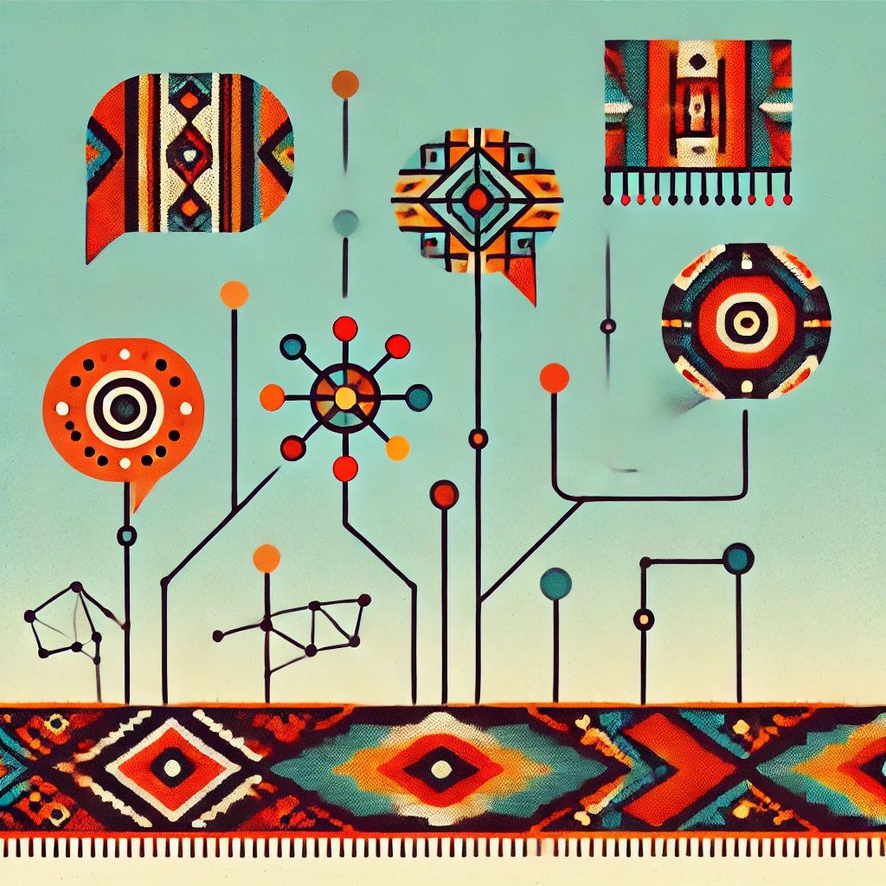
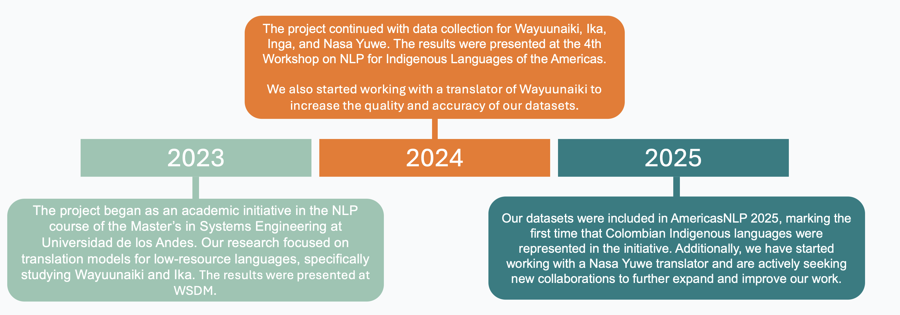

<!-- Sección Principal -->

  

    <h2>Towards cultural preservation</h2>
    <h1>Machine Translation for Indigenous Language Preservation</h1>
    

      Indigenous languages in Colombia face the risk of extinction due to the decline in native speakers and lack of digital resources. This project leverages AI-driven machine translation models tailored for low-resource languages, aiming to create digital tools that support linguistic preservation. Additionally, we are actively working on translations to expand the available datasets for Indigenous language machine translation, ensuring better model performance and broader linguistic coverage.
    

  

  

  

    
  

------------

<!-- Sección de la Historia del Proyecto -->

  <h2>Project Timeline</h2>
  

    
  

-----
