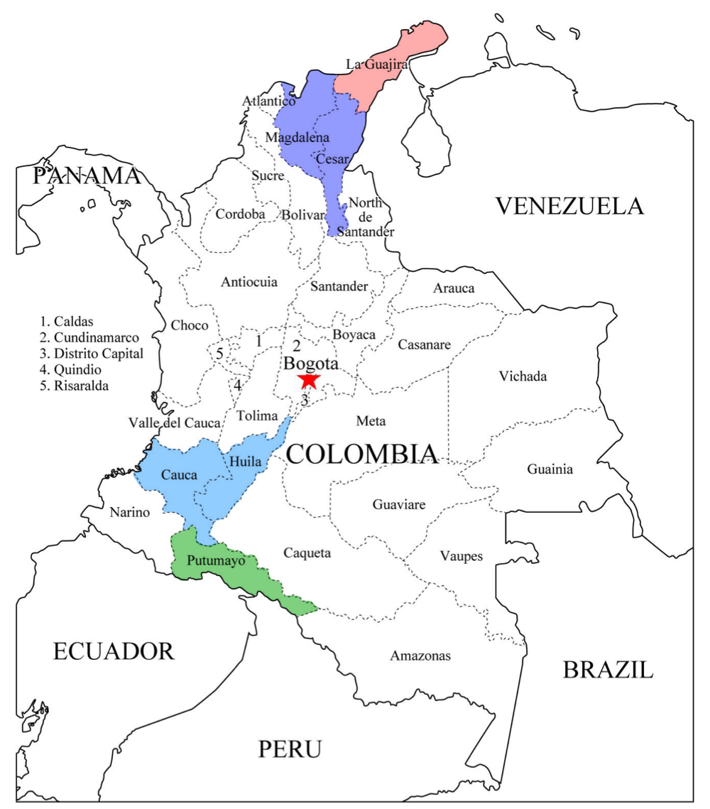

<!-- Barra de navegación fija con logo DISC (alineado con margen izquierdo de sección especial) -->

  

    
  

<!-- Sección Principal -->

  

    <h2>Towards cultural preservation</h2>
    <h1>Machine Translation for Indigenous Language Preservation</h1>
    

      Indigenous languages in Colombia face the risk of extinction due to the decline in native speakers and lack of digital resources. This project leverages AI-driven machine translation models tailored for low-resource languages, aiming to create digital tools that support linguistic preservation. Additionally, we are actively working on translations to expand the available datasets for Indigenous language machine translation, ensuring better model performance and broader linguistic coverage.
    

  

  

  

    
  

-------

<!-- Sección de Línea de Tiempo -->

  <h2 style="font-weight: bold;">Project Timeline</h2>

  

    

      <h3>2023</h3>
      
The project began as an academic initiative in the NLP course of the Master’s in Systems Engineering at Universidad de los Andes. Our research focused on translation models for low-resource languages, specifically studying Wayuunaiki and Ika. The results were presented at WSDM.

    

    

      <h3>2024</h3>
      
The project continued with data collection for Wayuunaiki, Ika, Inga, and Nasa Yuwe. The results were presented at the 4th Workshop on NLP for Indigenous Languages of the Americas. We also started working with a translator of Wayuunaiki to increase the quality and accuracy of our datasets.

    

    

      <h3>2025</h3>
      
Our datasets were included in AmericasNLP 2025, marking the first time that Colombian Indigenous languages were represented in the initiative. Additionally, we have started working with a Nasa Yuwe translator and are actively seeking new collaborations to further expand and improve our work.

    

  

------------

  
  

    <h2 style="font-weight: bold;">Our Methodology</h2>
    
We leverage high-resource language models to develop translators for low-resource Indigenous languages.  
       To achieve this, we gather valuable, high-quality translations of short phrases into Spanish,  
       working closely with native speakers and expert translators.

  

------------

  

    <h2 style="font-weight: bold;">Our Languages</h2>
    
Colombia is home to a rich linguistic heritage, including Wayuunaiki, Nasa Yuwe, Inga, and Arhuaco.  
       We collaborate with native speakers to support these languages:

    <ul>
      <li><strong style="color:rgb(213, 74, 62);">Wayuunaiki</strong> – Spoken by the Wayuu people in La Guajira, it is the most widely spoken Indigenous language in Colombia.</li>
      <li><strong style="color:rgb(32, 117, 145);">Nasa Yuwe</strong> – Used by the Nasa community in Cauca and neighboring regions, it is considered an isolated language with unique grammar.</li>    
      <li><strong style = "color:rgb(38, 133, 49);">Inga</strong> – A Quechuan language spoken in Putumayo and Nariño, preserving Incan linguistic traditions.</li>
      <li><strong  style = "color:rgb(99, 93, 207);">Arhuaco (Ika)</strong> – A Chibchan language spoken in the Sierra Nevada de Santa Marta, known for its complex structure.</li>
    </ul>
    
By working with native speakers, we help preserve and strengthen these languages through high-quality translations and language technology.

  

  

-------

  <h2 style="font-weight: bold;">Resources</h2>

  

    

      <h3>Datasets</h3>
    

    

      <h3>Models</h3>
      <li> <a href="https://www.dropbox.com/scl/fo/bj7ra25nbf0bjed5f6y92/ANxU5o3Qc0t1a-91dKbRcv4?rlkey=ag6dssslslwiqjrtg6kd8a8ym&st=ejt0m93b&dl=0" target="_blank">Wayuunaiki, Inga, Nasa Yuwe and Arhuaco models</a></li>
    

    

      <h3>Publications</h3>
      <ul>
        <li>Preserving Heritage: Developing a Translation Tool for Indigenous Dialects. In Proceedings of the 17th ACM International Conference on Web Search and Data Mining (WSDM '24). <a href="https://doi.org/10.1145/3616855.3637828" target="_blank">https://doi.org/10.1145/3616855.3637828</a></li>
        <li>Translation systems for low-resource Colombian Indigenous languages, a first step towards cultural preservation. In Proceedings of the 4th Workshop on Natural Language Processing for Indigenous Languages of the Americas (AmericasNLP 2024).<a href="https://aclanthology.org/2024.americasnlp-1.2/" target="_blank">https://aclanthology.org/2024.americasnlp-1.2/</a></li>
      </ul>
    

  

-------

  <h2 style="font-weight: bold;">Our team</h2>

  
  <!-- Team Member 1 -->
  

    
    <h3>Rubén Manrique</h3>
    
Lead Researcher

    
Universidad de Los Andes

  

  <!-- Team Member 2 -->
  

    
    <h3>Juan Camilo Prieto</h3>
    
Researcher

    
Universidad de Los Andes

  

  <!-- Team Member 3 -->
  

    
    <h3>Melissa Robles</h3>
    
Researcher

    
Universidad de Los Andes

  

  
  <!-- Team Member 1 -->
  

    
    <h3>Antonio José Ipuana</h3>
    
Wayuunaiki Translator

    
Wayuunaiki translation services

  

  <!-- Team Member 2 -->
  

    
    <h3>Manuel Muyuy</h3>
    
Nasa Yuwe Translator

    
Universidad de Cauca

  

<!-- -----

    

        <h2>Thank You for Visiting</h2>
        
If you would like to get in touch, feel free to contact us:

        
{rf.manrique, jc.prietoa, mv.robles}@uniandes.edu.co

    

    

        
    

 -->

<!-- Nuevo Footer -->

  

    

      <a href="https://apoyofinanciero.uniandes.edu.co/">Apoyo Financiero</a> |
      <a href="http://registro.uniandes.edu.co/">Admisiones y Registro</a> |
      <a href="http://biblioteca.uniandes.edu.co/">Biblioteca</a> |
      <a href="https://bloqueneon.uniandes.edu.co">Bloque Neon</a> |
      <a href="http://decanaturadeestudiantes.uniandes.edu.co/">Decanatura de Estudiantes</a>
       
      Universidad de los Andes | Vigilada Mineducación  
      Reconocimiento como Universidad: Decreto 1297 del 30 de mayo de 1964. 
      Reconocimiento personería jurídica: Resolución 28 del 23 de febrero de 1949 Minjusticia 
      Edificio Mario Laserna Cra 1Este No 19A - 40 Bogotá (Colombia) | Tel: [571] 3394949 Ext: 2860, 2861, 2862 | Fax: [571] 3324325  
      © 2025 - <a href="https://sistemas.uniandes.edu.co/">Departamento de Ingeniería de Sistemas y Computación</a>
    

  

